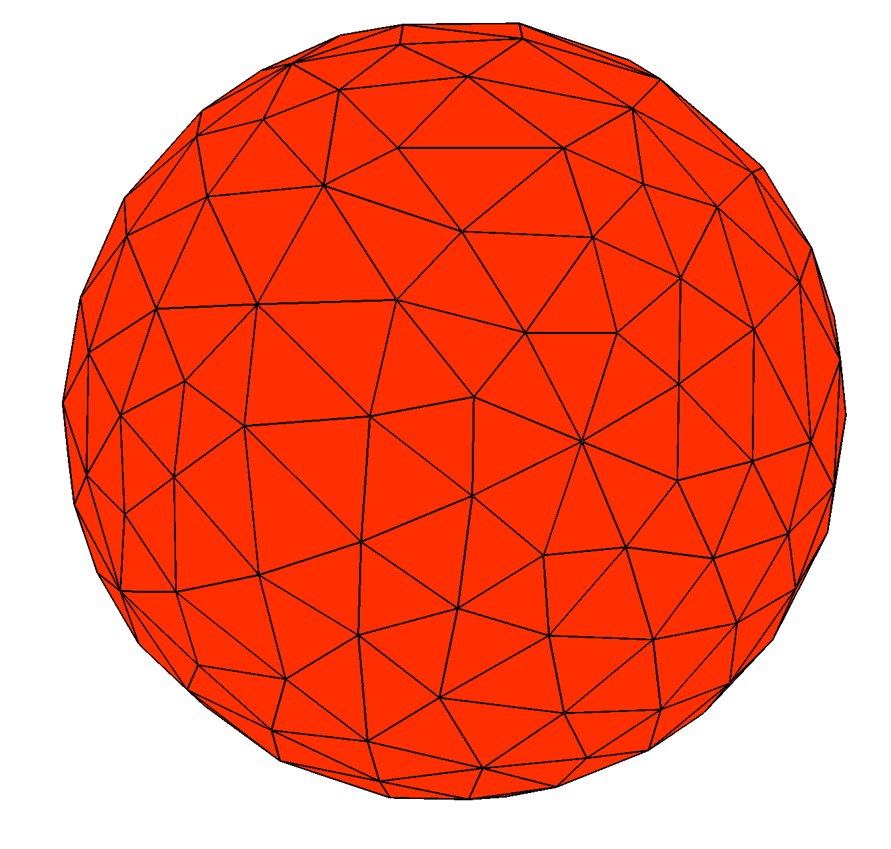
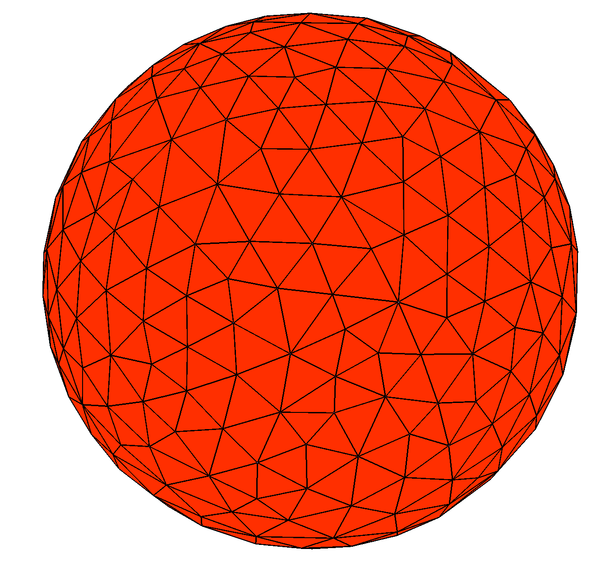
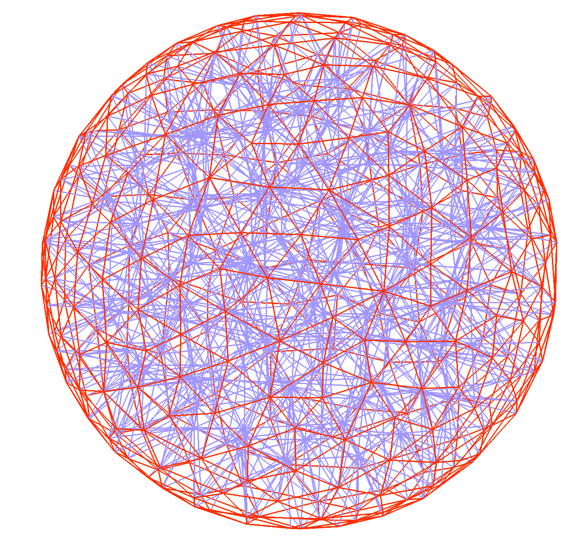
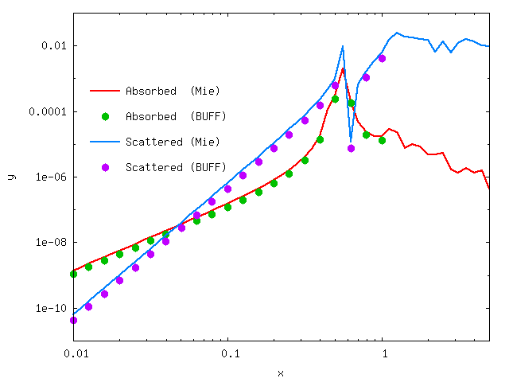

# Mie scattering in [[buff-em]]

In this example we use [[buff-scatter]] to solve the canonical textbook
problem of *Mie scattering*---the scattering of a plane wave
from a dielectric sphere. The files for this example are in the 
`share/buff-em/examples/MieScattering` subdirectory of the 
[[buff-em]] source distribution.

--------------------------------------------------
## <span class="SC">gmsh</span> geometry file and volume mesh for a single sphere

We begin by creating a 
[<span class="SC">gmsh</span>](http://geuz.org/gmsh) 
geometry file for a sphere: [(`Sphere.geo`)](Sphere.geo).
(Note that, because we will be producing a volume mesh instead 
of a surface mesh, the [[gmsh]] geometry file is not quite
the same as the file `Sphere.geo` that we used to 
generate surface meshes for 
[Mie scattering in <span class="SC">scuff-em</span>][scuffMie].

We turn this geometry file into coarser and finer 
volume meshes by running the following commands:

````bash
 % gmsh -3 -clscale 1.0  Sphere.geo
 % RenameMesh3D Sphere.msh

 % gmsh -3 -clscale 0.65 Sphere.geo
 % RenameMesh3D Sphere.msh
````

Here the `-3` option to [[gmsh]] says we want a 3D (volume) mesh 
(as opposed to `-2` for a 2D (surface) mesh. The `-clscale`
option sets an overall multiplicative prefactor that scales
the fineness of the meshing.

Also, the [[bash]] script [`RenameMesh3D`](../../reference/RenameMesh3D)
is a little utility that calls 
[<span class="SC">buff-analyze</span>](../../applications/buff-analyze.md)
to count the number of interior tetrahedon faces in the mesh 
(equal to the number of SWG basis functions, and thus
the dimension of the VIE matrix) and rename the meshfile to
reflect this information. The script also changes the file 
extension from `.msh` to `.vmsh` to remind me that this is a 
volume mesh instead of a surface mesh.

Thus the above steps produce files named 
`Sphere_677.vmsh` and `Sphere_1675.vmsh`. 
You can open these files in [[gmsh]] to see what they
look like:





Of course, from these pictures we can't tell that we 
are working with volume meshes instead of surface meshes.
To see the outlines of the tetrahedra, turn off the 
"Surface faces" display in the [[gmsh]] "Mesh" options 
tab:



--------------------------------------------------
## <span class="SC">buff-em</span> geometry file for a single sphere

Next we create a 
[<span class="SC">buff-em</span> geometry file][buffGeometries] 
that will tell [[buff-scatter]] about our geometry, including both 
the volume mesh and the material properties (dielectric function) 
of the sphere. As a first example, we'll use a dielectric model for
silicon carbide that expresses the relative permittivity as a
rational function of $\omega$; in this case we'll call the
geometry file `SiCSphere_677.buffgeo.`

````bash 
MATERIAL SiliconCarbide
   
   EpsInf = 6.7;
   a0     = -3.32377e28;
   a1     = +8.93329e11;
   b0     = -2.21677e28;
   b1     = 8.93329e11;
   Eps(w) = EpsInf * (a0 + i*a1*w + w*w) / ( b0 + i*b1*w + w*w);

ENDMATERIAL 

OBJECT TheSphere
        MESHFILE Sphere_677.vmsh
        MATERIAL SiliconCarbide
ENDOBJECT
````

(Note that, because this particular example involves an isotropic
and homogeneous (spatially constant) dielectric function, we
can simply use the `MATERIAL` keyword to specify a 
[<span class="SC">scuff-em</span> material property definition][scuffMaterials],
just as we would in a [[scuff-em]] geometry file. To specify
anisotropic and/or inhomogeneous materials in [[buff-em]], 
we would instead use the `SVTensor` keyword, as documented on 
the page 
[Spatially-varying permittivity tensors in <span class="SC">buff-em</span>][buffMaterials].
We will see an example of a `SVTensor` specification later
in this tutorial example.)

--------------------------------------------------
## Defining frequencies at which to run computations

Next, we create a simple file called
[`OmegaFile`](OmegaFile) containing a
list of angular frequencies at which to run the scattering problem:

````bash
    0.010
    0.013
    ...
    10.0
````

(We pause to note one subtlety here: As in [[scuff-em]],
angular frequencies specified
using the `--Omega` or `--OmegaFile` arguments are interpreted in 
units of $c / 1 \mu$m = $3\cdot 10^{14}$ rad/sec.
These are natural 
frequency units to use for problems involving micron-sized objects; 
in particular, for Mie scattering from a sphere of radius 1 μm, as 
we are considering here, the numerical value of `Omega` is just the 
quantity $kR$ (wavenumber times radius) known as the 
"size parameter" in the Mie scattering literature. In contrast, 
when specifying functions of angular frequency like `Eps(w)` in 
`MATERIAL...ENDMATERIAL` sections of geometry files or in any other 
[<span class="SC">buff-em</span> material description][buffMaterials], 
the `w` variable 
is always interpreted in units of **1 `rad/sec`**, because these are
the units in which tabulated material properties and functional forms
for model dielectric functions are typically expressed.)

--------------------------------------------------
## Running the sphere computation

Finally, we'll create a little text file called `Args` that will contain
a list of command-line options for [[buff-scatter]]; these will include
**(1)** a specification of the geometry, **(2)** the frequency list,
**(3)** the name of an output file for the power, force, and torque,
and **(4)** a specification of the incident field, which in
this case is a linearly polarized *z*-traveling plane wave
with **E**-field pointing in the *x* direction:

````bash
    geometry SiCSphere_677.buffgeo
    PFTFile SiCSphere.PFT
    OmegaFile OmegaFile
    pwDirection 0 0 1
    pwPolarization 1 0 0
````

And now we just pipe this little file into the standard input of [[buff-scatter]]:

````bash
    % buff-scatter < Args 
````

This produces the file `SiCSphere_677.PFT`, which contains one line
per simulated frequency; each line contains data on the scattered
and total power, the force, and the torque on the particle at that
frequency. (Look at the first few lines of the file for a text description
of how to interpret it.)

Here's a comparison of the [[buff-scatter]] results with the
analytical Mie series, as computed
using [this Mathematica script.](Mie.math) [Like most Mie codes, 
this script computes the absorption and scattering *cross-sections*, 
which we multiply by the incoming beam flux ($\frac{1}{2Z_0}$ for a 
unit-strength plane wave in vacuum) to get values for the absorbed 
and scattered *power*.]



--------------------------------------------------
## A note on computation time

As discussed [here][ComputationTimeNote], the first 
calculation done by [[buff-em]] on any given geometry
will be significantly slower than all subsequent 
calculations (including the 2nd and subsequent
frequencies in the `OmegaFile`, as well as any 
subsequent [[buff-scatter]] or [[buff-neq]]
runs you may do using the same object mesh, even
if you change the material properties). The reason
for this is that, when [[buff-em]] first assembles
the self-interaction block of the system matrix for 
a given object, it stores the most time-intensive 
portions of the calculation for later reuse.
(The data are stored in memory for reuse within the
same run, and are also written to disk in the form of 
a binary cache file for reuse in later runs).

For the particular calculation described here,
you can accelerate this process by downloading the
(13 megabyte) cache file for the `Sphere_677.vmsh`
from this link: 
[`Sphere_677.cache`](http://homerreid.com/Sphere_677.cache).
Put this file into your working directory when you
run [[buff-scatter]], and the calculation
will proceed much more quickly. 

For example, on my (fairly fast) laptop, computing
the cache file takes 12 minutes, after which computing
the PFT at each individual frequency takes about 20 seconds.

You can monitor the progress of the calculation by following 
the `buff-scatter.log` file. Note that, during
computationally-intensive operations such as the VIE matrix
assembly, the code should be using all available CPU cores
on your workstation; if you find that this is
not the case (for example, by monitoring CPU usage using
[<span class="SC">htop</span>](http://htop.sourceforge.net))
you may need to
[reconfigure and recompile with different [[openmp]] 
configuration options.](../../reference/Installing.md)

--------------------------------------------------
## Validating results for a gold sphere

Now let's redo the calculation for a sphere made of gold
instead of silicon carbide.  In this case we will name our
[[buff-em]] geometry file `GoldSphere.scuffgeo`:

````bash
    MATERIAL Gold
      wp = 1.37e16;
      gamma = 5.32e13;
      Eps(w) = 1 - wp^2 / (w * (w + i*gamma));
    ENDMATERIAL

    OBJECT TheSphere
        MESHFILE Sphere_677.vmsh
        MATERIAL Gold
    ENDOBJECT
    
````

Since most of the command-line arguments to [[buff-scatter]] will
be the same as before, we can reuse the same `Args` file, with the
options that need to be given new values specified on the command line:

````bash
% buff-scatter --geometry GoldSphere.scuffgeo --PFTFile GoldSphere.PFT < Args
    
````

Now our data look like this:


[buffGeometries]:                     ../../reference/Geometries.md
[buffMaterials]:                      ../../reference/SVTensors.md

[scuffMie]:                           http://homerreid.github.io/scuff-em-documentation/examples/MieScattering/MieScattering
[scuffMaterials]:                     http://homerreid.github.io/scuff-em-documentation/reference/Materials
[Pinwheels]:                          ../Pinwheels/Pinwheels.md
[buffAnalyze]:                        ../../applications/buff-analyze.md
[ComputationTimeNote]:                ../../reference/BUFFvsSCUFF.md#Caching
